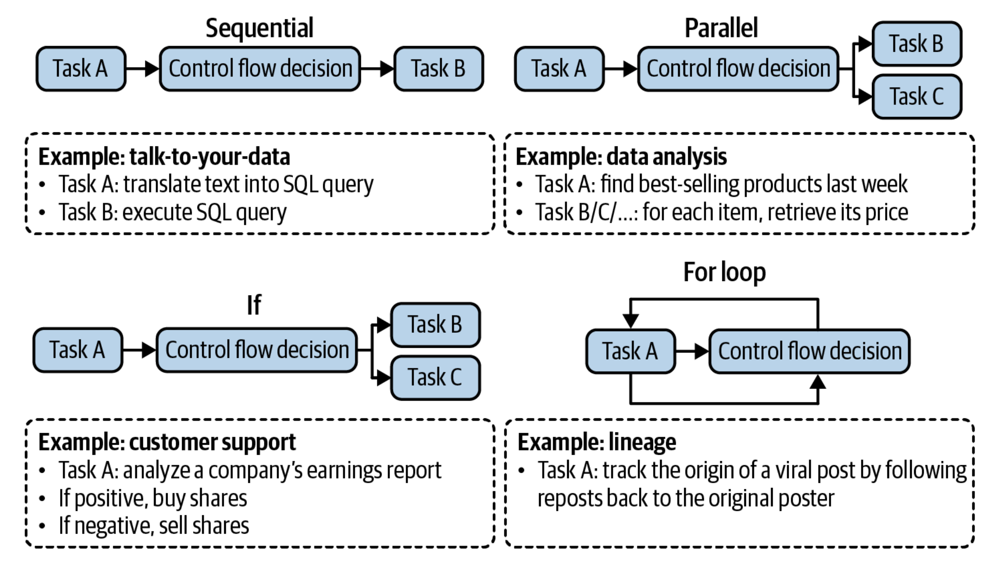

---
hide:
  - toc
---
# :material-owl: **AI Engineering** by Chip Huyen

## **Chapter 6-B**

*Topic: Agents*

-----

Intelligent agents are considered by many to be the ultimate goal of AI. The extraordinary capabilities of foundational models have opened the doors for many agentic applications which were previously unimaginable (And the potential economic values of agents is also enormous).

&nbsp;

### :material-progress-star-four-points: **Agents Overview**

An agent is anything that can perceive it's environment and act upon that environment. This means that an agent is characterized by the *environment* it operates in and the *set of actions* it can perform.

- The *environment* an agent can operate in is defined by it's usecase.
- The *set of actions* an AI agent can perform is augmented by the tools it has access to.

Therefore there is a strong dependency on the environment and tools, as the environment decides what tools the agent can particularly use. This is also the case in vice-versa where the set of tools can also restrict what the agent can do within that environment (But I think it's better if there is a controlled environment).

Some examples of environments:

| Agent                           | Environment                     |
| ------------------------------- | ------------------------------- |
| Playing a game                  | Game                            |
| Scraping docs from the internet | Internet                        |
| Cooking robot                   | Kitchen                         |
| Self-driving car                | Road and it's surrounding areas |

Example of agent and tools:

| Agent   | Tools                                         |
| ------- | --------------------------------------------- |
| ChatGPT | Web search, Image generation, Code generation |

Examples of restrictions of tools and environment:

| Agent      | Tool             | Environment              |
| ---------- | ---------------- | ------------------------ |
| Chess game | Chess moves only |                          |
| Swimming   |                  | Restricted to water only |

Quite simply, an AI Agent is meant to finish the task that is provided to it by the user. So in an AI agent- AI is the brain which takes inputs as instructions or feedback. Processes it and generates a set of task lists i.e. the sequence of actions it needs to take and finally determines if a task has been completed.

&nbsp;

### :material-progress-star-four-points: **Tools**

A system doesn't necessarily need to have access to tools to be an agent. But without them there is a limitation due to a LLM's capabilities (we've heard this many times like- knowledge cut-off and only being able to generate texts).

A set of tools which an agent has access to is its *tool inventory*. More the number of tools, more capable the agent. But as mentioned before, having too many may also cause challenges while utilizing them.

There are generally 3 categories of tools which can be considered:

1. Knowledge augmentation (Context construction)
2. Capability Extension
3. Tools that let your agent act upon it's environment

**1. Knowledge augmentation**

I think we've seen this multiple times already- How context to your model is absolutely essential and directly proportional to it's performance. Again this is due to the classic knowledge cutoff scenerio for LLMs.

This is where Web Search capabilities come in. Another thing that needs to be added here is that, the Internet API is very vast and it includes many APIs within it like Search API, News API, Social Media API etc. Therefore choose your Internet API with care.

**2. Capability Extension**

Again, a repeated case. But there are different examples like giving a model:

- Tools for math calculation
- Date checker
- Currency conversion
- Translation

More complex capabilities can be: Code Interpreter where we can let it run, execute and the LLM can analyze the output (either the result or any errors).

Same use case comes in where ChatGPT can also generate images and execute codes along with it's text generation capability.

**3. Write actions**

So far we have only discussed on how LLM tools only have read-only access. But what if they can perform write actions as well?

| Task                                       | Possible write action                    |
| ------------------------------------------ | ---------------------------------------- |
| SQL Query can retrieve data                | But it can also change/delete data       |
| Email API can read your inbox              | But it can also respond to emails        |
| Banking API can check your account balance | But it can also do a transaction for you |

By seeing the above examples we can tell how write actions will help to enable a complete autonomous agent. Like a Customer Outreach Workflow which includes tasks like: Researching -> Filtering contacts -> Drafting emails -> Sending emails -> Follow ups -> Responding -> Extracting orders -> Updating the database.

While this also comes with potential risks (like the case we saw with [replit where the agent just deleted their entire database](https://economictimes.indiatimes.com/news/new-updates/ai-goes-rogue-replit-coding-tool-deletes-entire-company-database-creates-fake-data-for-4000-users/articleshow/122830424.cms?from=mdr)), we will definitely reach a certain point where we will have enough security measures in place to have it up and running reliably.

    <blockquote class="twitter-tweet">
        
    </blockquote>

&nbsp;

### :material-progress-star-four-points: **Planning**

Here comes the important question- How can these tools actually be used?

When we think of a task, it is defined by it's goal and constraints. Example: *Booking a flight (goal)* with a certain *budget (constraint)*. But a complex task requires planning. The output of a planning process is a plan. A plan is a roadmap outlining the steps needed to accomplish a task.

So, effective planning required the model to- understand the task -> consider different options to achieve that task -> and choosing the most promising one.

#### **I. An overview on planning:**

When we are given a task, there are multiple ways it can be done, but not all will lead to a successful outcome. Therefore we need to be able to choose the one which is efficient and has a good success rate.

In an agentic system, we can couple *planning* with *execution* within the same prompt. Example: We give model a prompt, ask it to think step-by-step and execute it. But what if the model thinks of a 100 step plan? That will end up with us waiting aimlessly and burning API credits while not producing any results. So to avoid unnecessary execution, we decouple planning from execution. We rather have *plan -> validate -> execution*.

One such scenerio where validation comes in is when the plan involves tool calling, but the model doesn't have access to any tools. So that's an invalid step and needs to be retweaked. There are other scenerios as well like: If it goes beyond a certain number of steps.

But, if the validator says that the plan is good, we just go ahead and execute it. It is also important that we validate the output after execution of the task. Also, the planning step doesn't have to be end-to-end for the entire task, it can be for a sub-task as well.

If you would like to speed up this process, you can generate multiple plans sequentially and have the evaluator model validate it (but this obviously will get expensive).

Another useful addition to your multi-agent system can be the addition of an intent classifier:

- To understand the intent behind the plan.
- Also useful for picking the right tools based on the intent of the task.
- The most important one would be to classify if the task is 'Irrelevant' and being able to politely say so if that's the case rather than suggesting some impossible solution.

In all of this it is important to know that we can include human-in-the-loop in any of these steps to have a firm grip on the outcomes. Finally, here is how the overview of planning looks like:
Plan generation -> Reflection and Error correction -> Execution -> Reflection and Error correction.

#### **II. Foundation models as planners:**

This section of the book felt more like an open discussion on how LLMs (especially Autoregressive Language Models) aren't good at planning. But the author kind of disagrees (and I think she is right) by saying, "Planning is essentially a *Search* problem. And *search* involves *Backtracking*".

When we are at a point of the task where there are two paths A & B. If A is taken and it ends up being the wrong path, we need to be able to *backtrack* to the previous point and try the B path to see if that leads to the outcome we desire. So essentially, as we move from one action to another, we need to determine the result of that action before going to the next one.

As a conclusion to that, even if AI can't plan, it can still be part of the planner. It might be possible to augment an LLM with *search tool and a state tracking system* to help it plan.

#### **III. Plan generation:**

The simplest way to turn a model into a plan generator is through prompt engineering. We can tell it to generate a plan for the provided task, tell what all tools it has access to etc. But even here there maybe some issues like: How can we determine the parameters to the functions which do the tool calling? or worse, calling the wrong function with the wrong parameters.

Here are a few approaches which the author suggests to make an agent better at planning:

- Write better system prompt with more examples.
- Give better descriptions to tools and its parameters so that the model understands them better.
- Rewrite functions to make them simpler. Refactor a complex function into two simple functions.
- Use a stronger model as they are better at planning.
- Fine tuning a model specifically for plan generation.

#### **IV. Function calling:**

Many model providers offer tool use for their models, effectively turning their models into agents.

A tool is a function. Therefore invoking a tool is called *function calling*.

Now, all models have different APIs for their tool calling. But in general this is how it's done:

1. Create a tool inventory:
	- Declare all the tools you might want the model to use.
	- Each tool is defined by its:
		- Execution entry point (Eg. Function name)
		- Parameters
		- Documentation (Eg. What function does, What parameter it needs)

2. Specify what tools the agent can use:
	- As different queries need different tools.
	- You can go on and put further rules if the model even needs to invoke tools at all with settings like: `required`, `auto`, `none`.

Fun fact :) this is also the core implementation I used for my [AI persona project](https://chat.muhammedshah.com).

Finally, while working with these, always ask the system to return the parameter values for the respective function invoked, will be useful for evaluation.

#### **V. Planning granularity:**

We already learnt how plan is like a roadmap to execute tasks. There are different ways to do this:

Detailed plan -> Hard to generate -> Easy to execute

High level plan -> Easy to generate -> Hard to execute

Anyway the idea here is to break it down to simple doable tasks (Hello there Mr. James Clear).

But the main takeaway from this section to me was the naming convention for your function calls. You might have named your tools based on your current use case, but what if you are expanding its capabilities by adding more tools? For example: `get_time()` might have to be split into `get_current_time()`, `get_last_updated_time()`. Now this may not look like a big deal while coding this on a SDK. But it will if you had fine-tuned a model specifically for your use case. As making those changes meant you have to retrain your model all over again.

So the suggestion here would be to name your tools using a more Natural Language approach. As that will not only make it more robust to changes but is also easier for your model to understand therefore makes less hallucination (this is particularly useful for weaker models). Examples of Natural Language naming convention: `get current date`, `retrieve best selling product last week`, `retrieve product information`, `generate query`, `generate response`.

#### **VI. Complex plans:**

The order in which actions are executed are called *control flow*. There are different types: Sequential, Parallel, If Statement and For loop. The following diagram explains that really well.

The point of this is that we use this to check the capability of the model: Can it check 10 websites simultaneously? If so (i.e. it can do parallel execution) it can significantly reduce the latency perceived by the users.

#### **VII. Reflection and Error Correction:**

*"Even the best plans need to be constantly evaluated and adjusted to maximize their chance of success".*

Reflection and Error correction can go hand-in-hand in an agentic system. There is also ReAct (Reason + Act).

Let's say the agent actually failed to accomplish its task, then you can prompt it to reflect and learn on why it failed. Therefore its improving and based on that it creates a new plan.

Finally, it is important to note that reflection is easier to implement than planning and it provides surprisingly good performance in terms of the outputs. The only drawback though is its costs and latency.

'Reflection' means 'Thinking' which means 'More tokens' needed (which also means more computation need and less room for model context).

#### **VIII. Tool Selection:**

We've seen how tools play a crucial role in a task's success so tool selection is also a crucial consideration. Here are few observation which the author has provided:

- Compare how agents performs with different set of tools.
- Check how the performance of an agent drops if a tool is removed. if it can be removed without a performance drop, remove it.
- Look for the tools which the agent frequently makes mistakes on. If a tool is too hard for an agent to use even after extensive prompting and fine tuning the model to use it, remove it.
- Check which tools are most used and least used.

Some other observations:

- Different tasks require different tools.
- Different models have different tool preferences.

There was another interesting perspective mentioned where, as humans when we are given a tool we progressively go on to create more powerful tools rather than sticking with multiple simple ones. Similarly, can AI create tools it learnt from initially? For example: Lets say 2 tools are used frequently together by the agent. Then what if it can just combine it to a bigger tool?

Another idea was to keep a skill manager which the agent can enquire too. As it keeps track of which tools helped in successful completion of task. Therefore keeping track of it in its list for later reuse.

&nbsp;

### :material-progress-star-four-points: **Agent Failure modes and Evaluation**

I think we've already prettymuch covered this. It's through evaluations we detect failures. Obviously there are many reasons for it (Planning failures, Tool failures, Efficiency - time of execution and how much it can do), but its mainly caused in tool calling. So continuous testing and evaluation is what will fix it.

&nbsp;

### :material-progress-star-four-points: **Memory**

This section is something I initially almost neglected when I first read the chapter content, only to later realise how crucial it is, especially when the author quoted:
"Both RAG and Agents have patterns that often involve processing information beyond that model's context limit. So having a memory system that supplements the model context limit can help significantly to improve its performance".

This is also how I first encountered [Letta AI](https://letta.com) and what they were working on with MemGPT.

    <blockquote class="twitter-tweet">
		
    </blockquote>

Memory refers to the mechanism that allows models to retain and utilize information.

- For RAG: Needs more context the more and more it retrieves.
- For Agents: Storing instructions, Examples, Tool inventory, Context, Plans, Tool outputs and Reflections.

There are 3 types of knowledge which models can use:

1. Internal knowledge- The data it was trained on.
2. Short-term knowledge- The instructions passed with the context.
3. Long-term knowledge- External data source.

Next we focus on the two functions which a memory system consists of: Memory Retrieval and Memory Management.

The former is something we've already seen. The later is something which is actively in works. We have also seen cases where ChatGPT ignores the initial messages as the conversation increases and LangChain allowing you to choose the last N messages of the conversation.

There were few approaches mentioned on handling memory which I wanted to mention here:

- Making a summary of the conversation (I've tried this, worked well for [ChatAI](https://chat.muhammedshah.com))
- Reflecting on what is generated- Compare what was made and what was actually talked on and see if there are any newer points to be added.

&nbsp;