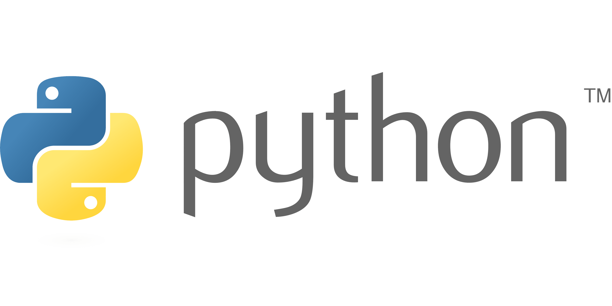

# :simple-codecrafters: Python Programming

Welcome to the **Python Programming** section of my documentation. This area is dedicated to my personal journey through David Beazley’s incredible Python course materials, available publicly on GitHub. From beginner concepts to advanced programming techniques, this section serves as both a learning companion and a quick reference guide as I solidify my Python foundations.

---

## 📚 About This Section

This section is based entirely on the work of **David Beazley**—a renowned educator and the author of many advanced Python programming resources. I have structured the content in a way that enhances my personal learning process. All credits for the original material go to [David Beazley](https://github.com/dabeaz), and this repo simply reflects my notes, explanations, and code implementations as I progress through his content.

---

## 🧭 Structure

Here’s how the documentation is structured:

- Practical Python: Covers foundational Python concepts including syntax, data structures, functions, control flow, and more.
- Advance Python: Dives into generators, coroutines, context managers, concurrency, metaprogramming, and performance tuning.
- Exercises: My solutions to all the exercises and challenges from the course.

---

## 📌 Reference Guide

- 📘 **Original Course Repository**: [https://github.com/dabeaz-course](https://github.com/dabeaz)
- 👨‍🏫 **Author**: David Beazley
- 🔖 **Disclaimer**: *All material and course content belong to David Beazley. This section only reorganizes and annotates the content for my personal understanding, revision, and structured learning.*

---

## 🚀 Why This Exists

I’m documenting my learning process so that:

1. I can retain complex concepts through structured notes.
2. I have a reference to revisit when applying Python in real-world projects.
3. Others on a similar path might also find value in a reorganized and readable format.

---

&nbsp;